# Umbra

## Disclaimer (Read Before Use)
> **Authorized Security Research Only**>
> This repository is published for **authorized security research, defensive validation, and educational purposes**. It contains **dual-use** implementation patterns that can be misused.
>**Built-in Safety**: MessageBox confirmation required before execution. Default payload is NOP instructions only.
> This project is governed by the **Security Research Educational License (SREL)**.  
> Use of this repository implies acceptance of the license terms.
> - Do not use this code to access systems without explicit permission.
> - Do not use this code for persistence, credential access, disruption, or harm.
> - Maintain strict scope control: isolated lab environments, clear approvals, and auditable experiments.
> - The authors accept no responsibility for any misuse of this code.

## Abstract
This project presents a modular execution framework designed to study advanced execution primitives on the Windows operating system. The research focuses on minimizing memory artifacts and analyzing the behavior of indirect system calls, dynamic resolution techniques, and call stack synthesis. It serves as a study in offensive security engineering and operating system internals, demonstrating how execution flow can be managed via indirect system calls and call stack synthesis.

**Note:** This framework operates entirely in User Mode (Ring 3). The capabilities are strictly limited to the permissions and visibility of a standard user process, without kernel-level access or privileges.

## Research Goals & Scope
This codebase explores Windows user-mode mechanisms in three primary areas:

- **Load-time Behavior**: A DLL entrypoint (`DllMain`) that performs one-time initialization, suitable for studying loader artifacts.
- **Low-level Call Routing**: Runtime resolution of NTDLL exports/stubs and routing via an indirect syscall path to maintain Control Flow Integrity (CFI).
- **Memory and Execution Primitives**: Section-backed mapping and threadpool-based execution primitives for controlled experiments.


## Build Configuration
The recommended toolchain for this project is **nightly**, but it may also build with the standard release channel.

**Recommended Build Command:**
```powershell
cargo +nightly build --release
```

**Standard Build Command:**
```powershell
cargo build --release
```


### Load and Execution Flow
The following diagram outlines the loader's operational lifecycle:

```mermaid
flowchart TD
  A[DLL Loaded] --> B[DllMain PROCESS_ATTACH]
  B --> C[ensure_payload_initialized]
  C --> D[Build-time seeded config present]
  C --> E[Resolve critical exports by hash]
  C --> F[Prepare payload bytes]
  F --> G[Section-backed dual-view mapping]
  G --> H[NOP landing pad + payload write]
  H --> I[Schedule execution via threadpool]
  I --> J[Worker callback transfers control]
  J --> K[Optional cleanup for one-shot mode]
```



## Technical Methodology

### 1. Control Flow Indirection (Indirect Syscalls)
The loader leverages **Indirect System Calls** to execute system services.
-   **Mechanism**: The loader dynamically resolves System Service Numbers (SSNs) and locates existing `syscall; ret` instructions within the `ntdll.dll` text section.
-   **SSN Resolution**: Implements a robust resolution strategy (Halo's Gate) to handle hooked exports by inferring SSNs from neighboring stubs.

#### Syscall Routing Pipeline


#### Gadget Selection Logic


### 2. Call Stack Synthesis (Stack Spoofing)
Standard execution often leaves anomalous call stacks pointing to unbacked memory regions. This framework implements **Synthetic Call Stack Construction**.
-   **Mechanism**: A chain of valid return addresses is constructed from `kernel32.dll` and `ntdll.dll` prior to execution.
-   **Structure**: The stack is built to resemble a standard thread initialization sequence: `[Payload] -> [Gadget] -> [BaseThreadInitThunk] -> [RtlUserThreadStart]`.

#### Indirect Syscall Sequence


### 3. Asynchronous Execution Strategy
The project utilizes the **Windows Thread Pool API** (`TpAllocWork`, `TpPostWork`) for execution.
-   **Mechanism**: The payload is submitted as a work item to the default process thread pool.
-   **Result**: Execution is handled by standard OS worker threads within the process context.

### 4. Payload Preparation & Artifact Minimization
The payload is prepared with specific memory characteristics to ensure execution stability.
-   **mapped_view**: Utilizes dual-view mapping (RW/RX) to avoid `VirtualProtect` transitions on executable memory.
-   **NOP Sled (Landing Pad)**: A sequence of NOP instructions is prepended to the payload in `src/dualview.rs`. This padding serves as a deterministic landing pad for execution stability.

## MITRE ATT&CK Mapping

The table below maps observable implementation patterns to MITRE ATT&CK techniques. This mapping is provided for research reporting and defensive validation.

| Area | Technique | Where in repo | What is implemented |
|---|---|---|---|
| Execution flow hijack (DLL) | **T1574.001** DLL Search Order Hijacking | `def/*.def`, `src/lib.rs`, `.cargo/config.toml` | A proxy/export surface suitable for studying DLL-based load behaviors. |
| Execution flow hijack (DLL) | **T1574.002** DLL Side-Loading | `def/*.def`, `src/proxy_exports.rs` | Proxy exports and delayed resolution of "real" DLL exports. |
| Component loading | **T1546.015** COM Hijacking | `def/com.def`, `src/com.rs` | A COM-facing export surface and class factory stub for studying COM loader paths. |
| Runtime API resolution | **T1027.007** Dynamic API Resolution | `src/hash.rs`, `src/ssn_resolver.rs` | Module walking and export lookup by hash, avoiding cleartext API names. |
| Obfuscation / decoding | **T1027** Obfuscated Files | `src/codec.rs`,`src/obfuscation.rs` | Payload decoding/decryption and build-time seeded constants. |
| In-memory code loading | **T1620** Reflective Code Loading | `src/dualview.rs`, `src/payload.rs` | In-memory executable region backed by section mapping. |
| Masquerading | **T1036** Masquerading | `src/stack_spoof.rs` | Call stack synthesis to mimic legitimate threads. |
| Native API | **T1106** Native API | `src/syscalls.rs` | Direct usage of `Nt*` APIs via indirect syscalls. |


